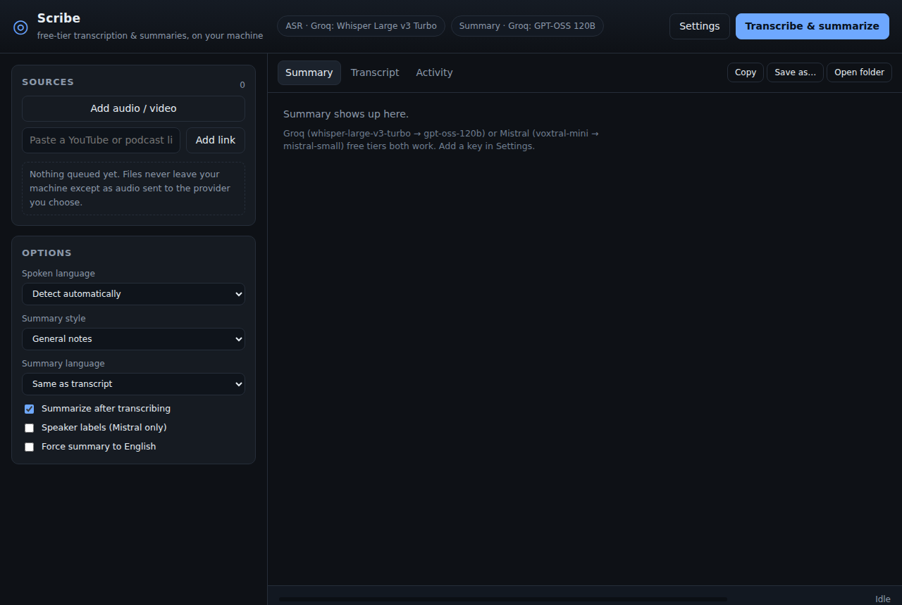

# Scribe

A small Windows desktop app that turns audio and video into a transcript **and** a structured summary,
using only **free-tier** APIs: **Groq** (Whisper Large v3 / Turbo) and **Mistral** (Voxtral) for
speech-to-text, Groq (GPT-OSS / Llama) and Mistral (Small / Large) for the summary.

Bring your own free key; nothing is sent anywhere else, and there is no account, no telemetry, no subscription.

```
┌───────────────┐   ffmpeg    ┌──────────────┐   HTTPS   ┌──────────────────┐
│ mp3/wav/mp4/  │ ──────────► │ 16 kHz mono  │ ────────► │ Groq Whisper  or │
│ mkv/mov/…     │  normalise  │ mp3 segments │           │ Mistral Voxtral  │
│ YouTube link  │   + split   │              │           └────────┬─────────┘
└───────────────┘             └──────────────┘                    │ transcript
                                                                   ▼
                       .md / .txt / .srt / .json  ◄──── map-reduce summary
                                                                  (Groq / Mistral chat)
```



## Install

Grab the installer from the [Releases](../../releases) page:

- `Scribe-<version>-win-x64.exe` — normal installer (per-user, no admin needed).
- `Scribe-<version>-win-x64.zip` — portable, unzip and run `Scribe.exe`.

Windows 10/11 x64. The app is unsigned, so SmartScreen will grumble — *More info → Run anyway*.

## Get the free keys (2 minutes, no card)

1. **Groq** — <https://console.groq.com/keys> → *Create API key*. Free tier covers
   `whisper-large-v3-turbo` and `whisper-large-v3` plus the chat models. Upload limit: **25 MB per request**.
2. **Mistral** — <https://console.mistral.ai/api-keys> → free *Experiment* plan. Covers
   `voxtral-mini-latest` (transcription, up to 3 h per request, optional speaker labels) and the chat models.
   Free tier allows **1 request/second** per key.

Paste them into **Settings** inside the app; keys are encrypted with Windows DPAPI and stored in
`%APPDATA%\Scribe\settings.json`.

You only need one provider, but both is best: Whisper Turbo is the fastest transcriber, Voxtral handles
very long files in one shot, and mixing engines across the transcribe / summarise stages is allowed.

## Use

1. **Add audio / video** (multi-select works) or paste a **YouTube / podcast link**.
   Links use `yt-dlp`, which the app downloads on first use (~15 MB) — it does not ship inside the installer.
2. Pick the spoken language (or let it detect), a summary style (general / meeting / lecture / interview / research)
   and the summary language.
3. Hit **Transcribe & summarize**. Progress, retries and rate-limit waits are all shown in the **Activity** tab.
4. Results land in `Downloads\Scribe\<name>\` as five files:

| File | Contents |
| --- | --- |
| `<name>.summary.md` | TL;DR, key points, actions & decisions, notable quotes |
| `<name>.transcript.md` | summary + timestamped transcript in one document |
| `<name>.transcript.txt` | raw timestamped transcript |
| `<name>.srt` | subtitles, real timecodes across the whole recording |
| `<name>.json` | everything, machine-readable |

## How it behaves under free-tier limits

- **Size**: everything is transcoded to 16 kHz mono MP3 (what Whisper/Voxtral downsample to internally),
  then split into 15-minute parts (~7 MB each). Long recordings therefore cost several requests instead of
  one rejected 300 MB upload. Every part is checked against the provider cap **before** it is sent, and the
  error tells you to shorten the segment length rather than silently failing.
- **Rate limits**: 429/5xx are retried with exponential backoff, honouring `Retry-After`, up to 4 attempts.
  Requests are serialised per provider so the Mistral free tier's 1 req/s ceiling is respected.
- **Tokens**: transcripts longer than ~9 000 characters are summarised as map-reduce — notes per window,
  then one pass that produces the final structure — so an hour-long recording doesn't blow the free
  token-per-minute ceiling.
- **Timecodes**: each part's segment timestamps are offset by its real start time, so the `.srt` is
  continuous across parts.
- **Cancelling** kills ffmpeg and the in-flight request and cleans up its temp files.

## Build from source

```bash
npm install
npm start          # run the app
npm run verify     # headless end-to-end test: real ffmpeg + a mock Groq/Mistral server
npm run dist       # electron-builder --win  (produce the installer)
```

`npm run verify` needs no API keys: it spins up a local server that mimics both providers (including a
deliberate 429 to test retries) and asserts chunking, upload sizes, timestamp offsets, the map-reduce
summary and every output file format.

Windows builds are produced by `.github/workflows/windows-build.yml` on GitHub's Windows runner and
attached to releases; the verification job runs first, so a release only exists if the pipeline tests pass.

## Notes and limits

- Speaker labels (`diarize`) are a Mistral-only option; Groq has no diarization parameter.
- Whisper's `translation` endpoint isn't used — only the requested summary language is translated.
- Not bundled: no key, no local model, no offline mode. This is deliberately a thin client for free hosted APIs.
- Requires an internet connection for the transcribe/summarise stages.

## License

MIT — see [LICENSE](LICENSE).
